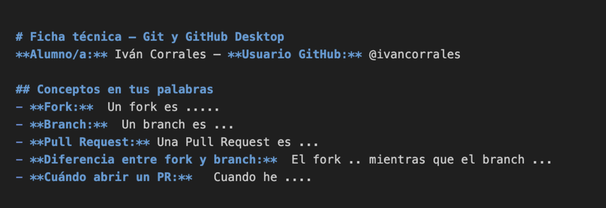
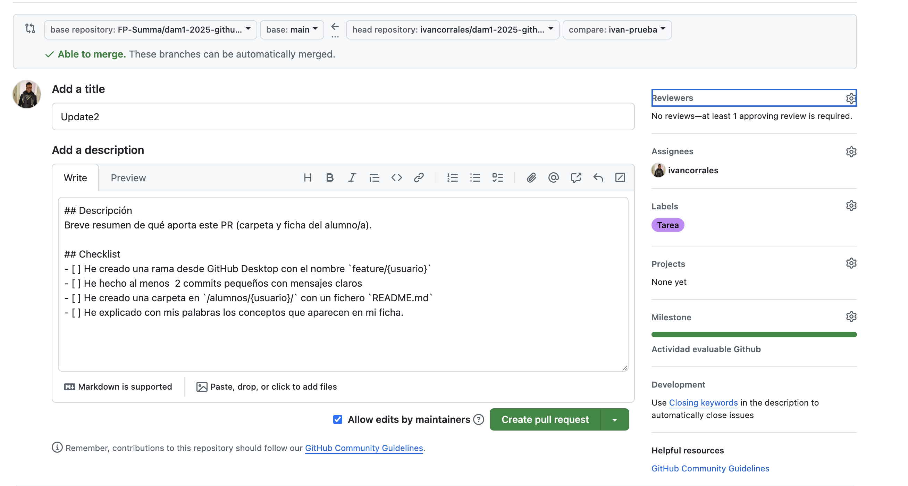
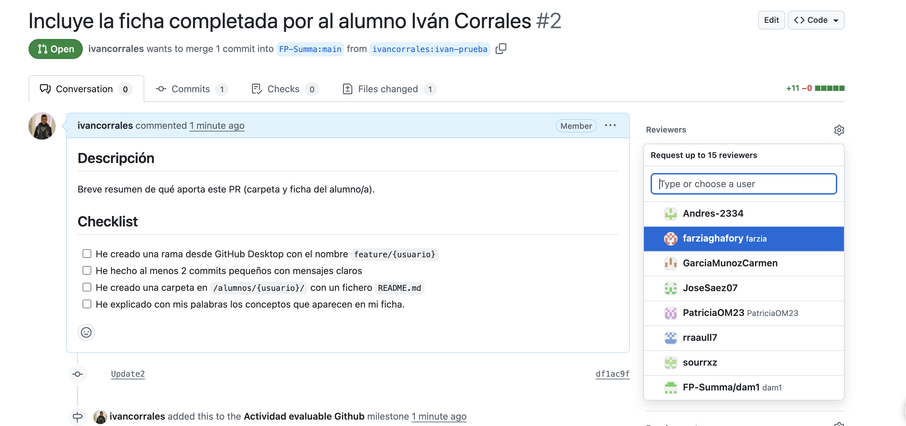
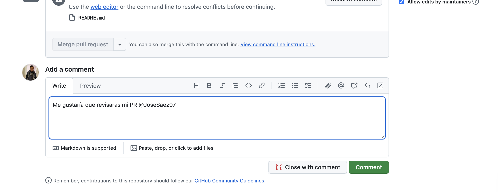
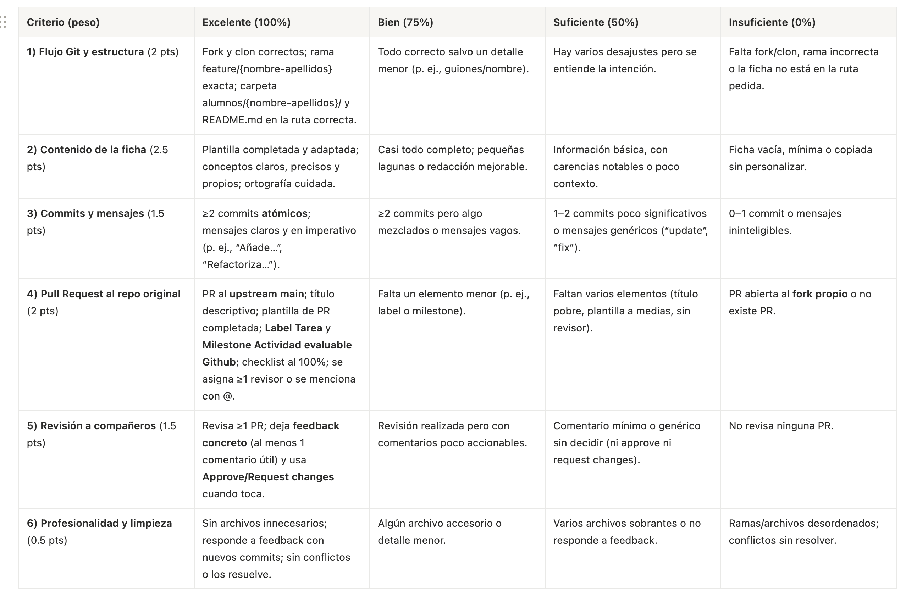

# Reto evaluable

Qué vas a hacer: crearás tu ficha técnica de conceptos Git/GitHub Desktop dentro de este repo, y abrirás un Pull Request para que dos compañeros te revisen.

## Pasos (síguelos en orden)

**NOTA: REMPLAZA {tu-usuario} POR TU NOMBRE Y APELLIDOS**

1.	Haz un fork de este repositorio (botón Fork en GitHub).
2.	En GitHub Desktop: File → Clone repository y clona tu fork.
3.	Crea una rama nueva en GitHub Desktop:
    *	Nombre: feature/{tu-usuario} (ej: feature/ana-garcia)
4.	Crea tu carpeta y archivo:
	*	Dentro de /alumnos/, crea la carpeta /{tu-usuario}/.
	*	Copia plantillas/ficha.md a /alumnos/{tu-usuario}/README.md.
5.	Rellena la ficha en /alumnos/{tu-usuario}/README.md.
    *   Completa los campos en el propio fichero que has creado
        
	*	Haz mínimo 2 commits pequeños (ej.: uno al crear el fichero README.md,  uno por sección completada,...).
	*	Escribe mensajes de commit claros.
6.	Push de tu rama al remoto (GitHub Desktop → Publish branch / Push origin).
7.	Abre un Pull Request hacia main del repositorio original (no tu fork).
	*	Se abrirá con la plantilla de PR: complétala.
    *   Añade un titulo descriptivo a la Pull Request
    *   Remplaza `feature/{tu-usuario}` por el nombre de tu rama (ej: `feature/ivan-corrales`).
	*	Añade la etiqueta (Labels) `Tarea` y el hito (Milestone) `Actividad evaluable Github`, tal y como se muestra en la siguiente imagen:
    
	*	Asigna al menos 1 revisor (ó más) o menciona a 1 compañeros con @.
    
    
    *  Asegurate que has completado el checklist para poder crear una PR.
    
8.	Revisa 1 PRs de compañeros:
	*	En cada PR deja al menos 1 comentarios.
	*	Termina con `Approve` si está correcto o `Request changes` con feedback concreto.
9.	Si te piden cambios, hazlos en tu misma rama y vuelve a push.
10.	Cuando tu PR tenga 1 aprobación, marca en el PR que está listo. Yo (@ivancorrales) haré el merge después.

## Rúbrica de evaluación
Se aplicarán los criterios indicados en la siguiente tabla:

### **Requisitos mínimos para superarla**

- Debe existir una **PR al repositorio original** y al menos **1 revisión realizada a un compañero/a**.

### **Penalizaciones (si aplican)**
- Entrega fuera de tiempo de clase: −0.5
- Subir ficheros innecesarios (binarios, .DS_Store, etc.) de forma reiterada: −0.25